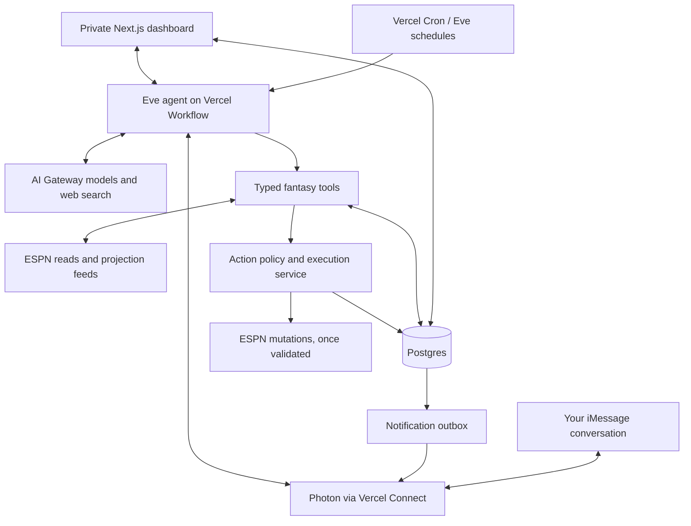

# Fantasy manager with Eve

Planning baseline: September 17, 2026. This is an implementation plan, not a deployed application.

## Product and assumptions

A private app manages one ESPN fantasy team, explains decisions, and sends updates through Photon. Eve is the decision-making agent; Vercel hosts the Next.js app, agent runtime, schedules, and durable execution. Start with one owner and one league.

Assume NFL football for scheduling examples until the sport is confirmed. Read scoring, eligible positions, lineup locks, waiver rules, trade deadlines, and roster limits from the actual league. Do not hard-code PPR or NFL rules into the shared orchestration. Assume “Eve” means the framework at eve.dev and “Photon connector” means its iMessage channel through Vercel Connect, which current documentation explicitly supports.

## What the research establishes

- The supplied `jwulff/fantasy-sports` repository supports ESPN reads. Its README explicitly says lineup changes, waiver claims, and trades have not been implemented. It is a useful reference and initial read adapter, not a complete execution backend.
- ESPN access in that repository is unofficial and uses `espn_s2` and `SWID` session cookies. Cookie expiration and upstream schema changes are ongoing operational concerns.
- Eve sessions already execute on Vercel Workflow when deployed to Vercel. Do not add another general-purpose agent loop around Eve.
- Eve's `defineSchedule` files become Vercel Cron jobs. Use handler schedules when work needs channel delivery or human input; markdown task-mode schedules cannot park for approval.
- `withEve` from `eve/next` deploys Next.js and Eve together in one Vercel project while keeping their runtimes as separate services.
- Eve has a Photon iMessage channel and `connectPhotonCredentials` integration. Its documented setup command is `eve add channel/photon-imessage`.
- AI Gateway supports native provider search and search across providers. Eve's built-in `web_search` currently defaults to Exa for Gateway models.
- Eve is in beta. Pin tested versions and use bundled, version-matched documentation during implementation; current online documentation can be ahead of an installed release.

## Architecture

Use a Next.js App Router application with TypeScript, Eve, and managed Postgres through Vercel Marketplace, such as Neon. Keep an optional browser reader behind a separate tool for sources that require page rendering. Normal news lookup uses Gateway search without launching a browser.

Postgres owns league snapshots, evidence, decisions, preferences, actions, approvals, schedules, and delivery records. Eve session state handles conversational continuity. Agent memory may recall preferences and earlier decisions, but it never substitutes for fresh ESPN state.

Use production OIDC for AI Gateway and Vercel Connect for Photon. ESPN credentials stay in server-side secret storage; tools resolve them internally. Do not put them in prompts, client bundles, agent shell environments, logs, or workflow arguments. Initially expose only the typed tools needed for fantasy management, plus web research.

## Agent responsibilities and tools

Eve reviews the league, researches developments, compares strategies, proposes structured actions, and explains the outcome. Numeric calculations and league-rule checks belong in deterministic application code.

Suggested tool contracts:

- `getLeagueSnapshot`: settings, roster, matchup, standings, free agents, pending transactions, and deadlines, with source timestamps.
- `getProjections`: normalized player IDs, projection horizon, scoring basis, source, timestamp, and available uncertainty data.
- `researchPlayers`: cited injury, practice, role, matchup, weather, and schedule news.
- `evaluateLineup`: legal assignments, expected points, alternatives, projected gain, and relevant constraints.
- `evaluateWaiver` and `evaluateTrade`: immediate and rest-of-season value, replacement value, positional needs, acquisition costs, and roster consequences.
- `recordDecision`: candidates considered, evidence, reasons selected or rejected, and proposed action IDs.
- `requestAction`: submit an exact typed proposal to application policy. Eve cannot declare its own proposal authorized.
- `getActionStatus`: read authoritative execution and reconciliation results.

The execution service independently checks identity, configured permissions, roster state, freshness, locks, FAAB, and action limits. There is one mutation path shared by scheduled work, dashboard actions, and text commands.

## A daily run

1. Claim a run keyed by league, season, run type, and scheduled occurrence. Record its status before starting expensive work.
2. Read current ESPN settings, roster, matchup, standings, available players, and transactions. Save a timestamped snapshot.
3. Fetch projections and research relevant changes. Prioritize starters, injury replacements, close lineup choices, and plausible acquisition targets.
4. Calculate legal lineup options and quantify candidate waiver/trade outcomes. Include “no change” as an explicit candidate.
5. Have Eve produce a validated decision record with concise reasons, linked evidence, uncertainty, and exact proposed actions.
6. Apply the configured policy: record only, request approval, or execute within standing limits.
7. Immediately before a write, re-read relevant ESPN state and validate that the proposal still applies. Invalidate changed or expired proposals.
8. Read back the result from ESPN. Distinguish a queued waiver claim or submitted trade offer from a completed roster transaction.
9. Commit the outcome and notification intent together. Send a Photon summary with a dashboard link; persist delivery status separately.

## Research and projection quality

Use ESPN projections as a baseline where available and suitable for the sport and scoring rules. The reference CLI's normalized outputs may need extension to expose projection fields. Add a licensed independent projection feed after validating access, coverage, update frequency, and cost; provider selection is an explicit implementation decision.

Normalize raw statistical projections to league scoring where possible. If a feed supplies fantasy points only, require matching scoring settings and disclose limitations for custom bonuses. Resolve player identity with stable provider mappings rather than names alone. Treat missing projections as missing, not zero.

Store each source's URL or provider identifier, publication time when available, retrieval time, relevant evidence, and effective week/game. Search results supply current evidence; they do not become authoritative numerical projections merely because the model cites them. Prefer official injury reports and well-sourced reporting. Require fresh verification for last-minute availability changes.

Start with one validated projection source plus ESPN, using a documented blend only when the two are comparable. Evaluate sources over time against actual outcomes and historical lineup choices using information available at the decision time. Do not label a source “best” without evidence or let Eve invent numeric precision.

Use Gateway search through Eve's built-in tool first. A custom research tool can select a native provider search implementation if useful, with model/tool compatibility checked for fallbacks. Search and fetched pages are evidence, never instructions authorizing roster changes. An optional browser reader can extract visible public pages that search cannot adequately retrieve; it does not share ESPN credentials.

## Autonomy settings

These are recommended initial product defaults, to be configured once rather than asking for every routine lineup adjustment.

| Action | Initial mode | Later automation constraints |
| --- | --- | --- |
| Research, standings, recommendations | Automatic | Per-run model/search budget |
| Starter/bench and eligible IR moves | Automatic after adapter validation and observation period | Legal, unlocked roster; fresh data; meaningful expected improvement |
| Adds, drops, and waiver claims | Approval | Protected players, per-claim FAAB cap, weekly cap, minimum remaining budget, pending-bid accounting |
| Generate trade ideas | Automatic | Rest-of-season value, both teams' needs, proposal frequency limits |
| Send trade offers | Approval | Explicit trade-send policy, value thresholds, cooldowns, maximum outstanding offers |
| Accept incoming trades | Approval | Separate opt-in policy from sending offers |

The app exposes `observe`, `approve`, and `autopilot` modes by action type, plus a global pause switch. An approval is tied to an immutable action ID, exact terms, roster snapshot, and expiration. No answer means no approval. Changed trade terms, changed roster state, or a passed deadline require re-evaluation.

## Scheduling

Use one handler-form Eve dispatcher schedule, initially every five minutes on Vercel Pro. It checks due work cheaply in Postgres and starts agent analysis only when needed. Store actual due times in UTC and calculate user-facing times using `America/New_York` or the configured IANA timezone, including daylight saving changes.

| Work | Suggested cadence |
| --- | --- |
| Full review and Photon digest | Daily at 8 a.m. local time |
| Lineup/injury checks | Approximately 60 and 15 minutes before relevant game or roster locks |
| Waiver review | Before the league's actual waiver deadline |
| Trade evaluation | Weekly, plus new offers and meaningful roster changes |
| Results review | After the scoring period settles |
| Retry/reconciliation and delivery checks | Dispatcher-driven, without a model call unless needed |

NFL timing is illustrative. NBA and other daily-lineup leagues need different game, roster-lock, and acquisition schedules. Derive dates from league/provider data rather than fixed weekday assumptions.

Vercel Hobby permits daily cron execution with hour-level precision; current Pro scheduling supports minute-level intervals and precision. Use Pro for the proposed dispatcher and deadline checks. Neither cron nor model execution is a hard real-time guarantee: use lead time, expire late work, and surface missed checks.

## Photon behavior

Connect the Eve Photon channel through Vercel Connect and register the intended recipient/conversation. Verify incoming webhooks and allow only the owner's configured identity to issue management commands.

Send a daily digest even when no move is warranted. Send additional updates for verified changes, approval requests, pending action outcomes, and failures requiring attention. Routine repeated polls remain quiet.

Example message shape: “Roster checked. One lineup change verified; projected improvement +3.1 points. Considered two waiver targets and held both. You are 4th at 2–1. Review: [link].” These numbers are illustrative, not current league facts.

Support commands such as `status`, `why did you bench …`, `pause`, `resume`, `approve A17`, and `skip A17`. Bind approvals to stored proposals and the authenticated owner; ambiguous conversational replies must not execute a different action.

Use Eve's channel for conversation. For durable proactive notifications, use an application-owned outbox and the Photon API behind an adapter using the connector's supported credential path. A channel `send` starts/resumes an agent session; it is not a generic notification queue. Validate outbound delivery and provider idempotency capabilities in the initial integration spike. Provider acceptance and delivery receipts, when available, are different states.

## Dashboard

Keep the app small: three primary views and settings.

- **Overview:** league rank, record, points for/against, current matchup, roster/injury issues, remaining FAAB, last successful check, next check, and current autonomy mode. Every live-looking value has an as-of timestamp.
- **Activity:** chronological runs with moves considered, rejected, awaiting approval, submitted, verified, or failed. Expand an entry for before/after roster, projection difference, cited sources, and concise rationale.
- **Decisions:** pending approvals and trade/waiver ideas, exact terms, expiration, approve/skip controls, and the associated text conversation.
- **Settings:** team connection health, modes by action type, protected players, budgets, notification preferences, and pause/resume.

Show estimated win/playoff probabilities only after implementing and labeling a real calculation. Avoid presenting a model's guess as league data. An optional small Eve chat panel can use `useEveAgent`; the dashboard should remain useful without opening chat.

## Persistence and reliability

Core tables: `league_connections`, `league_snapshots`, `player_mappings`, `projections`, `research_evidence`, `runs`, `decisions`, `actions`, `approvals`, `policies`, `scheduled_jobs`, and `notification_outbox`. Include owner, league, season, scoring period, source timestamps, schema version, and run/action IDs where relevant.

An action progresses through `proposed → awaiting_approval/ready → executing → submitted → verified`, with explicit `rejected`, `expired`, `failed`, and `unknown` outcomes. Some submitted transactions remain pending until ESPN processes them. Store external transaction IDs and expected effects.

Claim mutations atomically with a per-team lease and stable operation key; serialize conflicting writes. Recheck the latest policy and pause state immediately before execution. Do not hold a database transaction open across a network request.

Workflow durability does not make ESPN side effects exactly once. After a timeout or crash following a write, mark the outcome unknown and reconcile with ESPN before retrying. If no reliable evidence establishes the result, stop that action and notify the owner. Apply the same principle to Photon deliveries, using provider idempotency when supported.

Handle expired cookies, schema drift, missing projections, unavailable search, and stale state explicitly. Continue showing the last known snapshot with its age, and pause writes that require unavailable information. App authentication must also protect Eve routes; a private-looking dashboard alone does not protect the agent API.

## Delivery sequence and acceptance gates

1. **Integration feasibility:** confirm sport, league/team, scoring settings, credentials, and projection availability. Prove ESPN reads, one scheduled Eve run, Gateway search with source capture, and Photon outbound/inbound identity. Investigate supported authenticated mutation capabilities separately for lineup, waiver, and trade operations. Produce a capability matrix rather than assuming the reference repo supports them.
2. **Deployed observation mode:** Next.js overview/activity pages, Postgres snapshots and decision records, daily research, and Photon digest. Replay runs without duplicate business records and show source freshness. No live mutations during observation.
3. **Lineup autopilot:** implement and validate the lineup adapter; run against fixtures and a test league where available. Verify legal slot assignment, lock handling, changed rosters, competing runs, pause behavior, ambiguous responses, and ESPN read-back. Enable only the supported action types.
4. **Waivers and trades:** add valuation, exact proposal approvals through text/dashboard, expiration, spending/protected-player policies, and mutation adapters. Verify pending versus completed transaction states. Recommendations ship even if a particular write capability remains unsupported.
5. **Operational hardening:** deadline checks, notification retry/reconciliation, connection-health alerts, model/search budgets, projection-source evaluation, and a weekly outcomes report.

Use an isolated preview database with mutations disabled, then deploy production in observation mode. Pin Eve/AI SDK/Workflow-compatible dependencies; verify generated Cron entries, real scheduled execution, webhook routing, authentication, and production secret isolation. Test failure windows before turning on autonomous mutations.

The first milestone is a real daily ESPN snapshot → researched decision → dashboard record → delivered Photon text. The first automation milestone is a verified lineup adjustment. Trade submission is its own later capability, not an assumed extension of reading trade data.

## Costs and remaining decisions

Budget separately for Vercel Pro, Workflow/compute, Postgres, model tokens, search calls, Photon service/line, and an optional projection subscription or browser service. Set a configurable daily AI/search ceiling, maximum tool calls per run, and a monthly alert. Measure the observation period before estimating steady-state spend.

Before implementation, confirm the sport and target team, whether Eve/Photon already have existing deployments, the desired action permissions, projection-data budget, and digest time. These do not prevent architecture planning; they control concrete setup and automation policy.

## Sources checked

- https://github.com/jwulff/fantasy-sports — current read support and missing writes.
- https://eve.dev/llms.txt — framework overview and beta status.
- https://eve.dev/docs/guides/frontend/nextjs — Next.js integration.
- https://eve.dev/docs/guides/deployment/vercel — deployment, OIDC, Workflow, and Cron.
- https://eve.dev/docs/concepts/execution-model-and-durability — session execution and replay.
- https://eve.dev/docs/schedules — schedule dispatch, UTC, and approval limitations.
- https://eve.dev/docs/channels/photon — Photon channel and Vercel Connect.
- https://eve.dev/docs/concepts/built-in-tools — Eve web search defaults.
- https://eve.dev/docs/patterns/durable-cross-channel-notifications — outbox and delivery ambiguity.
- https://vercel.com/docs/ai-gateway/models-and-providers/web-search — provider-native and cross-provider search.
- https://vercel.com/docs/cron-jobs/usage-and-pricing — current plan frequency and precision limits.
